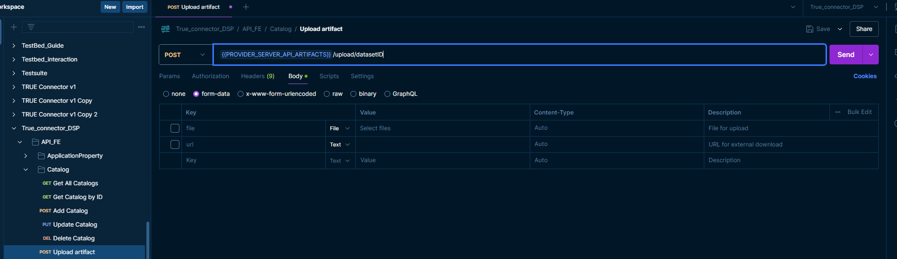

# Upload data

To upload and artifact(data) to the TRUE Connector you can use Postman and the following request:

datasetID - id of the dataset for which you upload the artifact
file - if you wish to upload a file to the MongoDB this is were you will select it
url - URL of the data that is located on an external server, cloud etc.

**NOTE** Please keep in mind that if both fields are filled file will take priority!  
**NOTE** Content-type field should remain on auto!