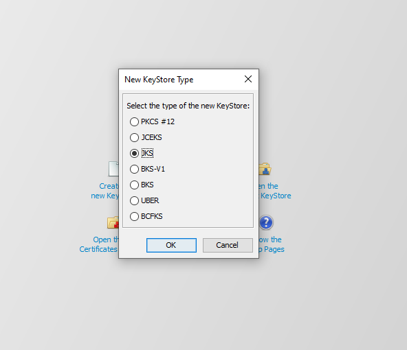
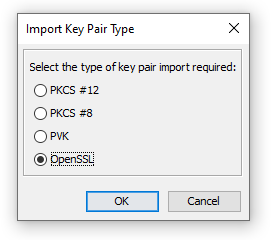
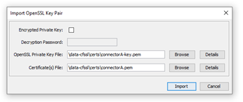
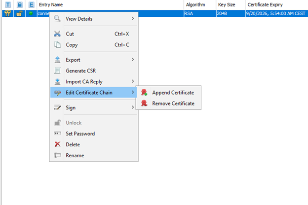
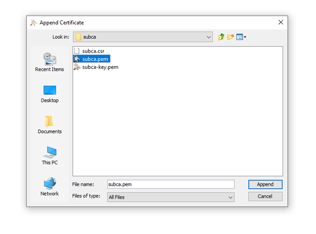
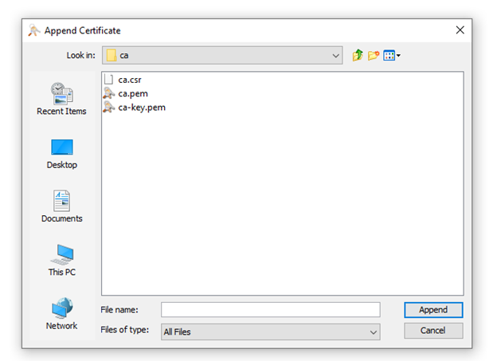
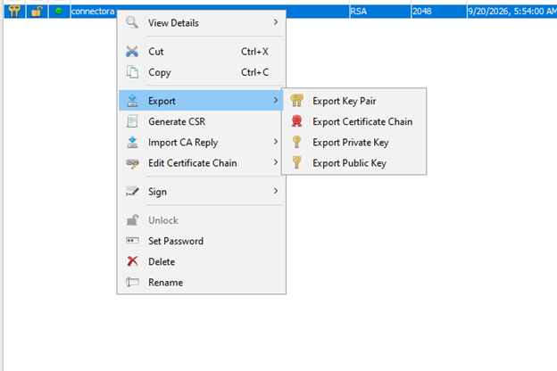
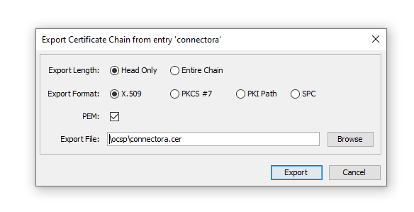

# OCSP GUIDE

## Preparation

Download executables from:

https://github.com/cloudflare/cfssl/releases/

Current latest version is v1.6.5

Required files are:

 - cfssl_1.6.5_*
 - cfssljson_1.6.5_*
 
SQLLite3 is also required - https://www.sqlite.org/download.html
 
Depending on your OS, you should download Windows or Linux distribution. For Windows, add those 2 files on path, and rename the to the cfssl.exe and cfssljson.exe, respectively. 

Once files are on OS path, you can execute **setup_PKI.sh** script (Gitbash was used in case of Windows OS).

Configuration used to create certificates can be found in pkiInput. Json files located in this folder holds configuration, like SAN (SubjectAlternativeNames) and other. Be sure to make changes according that match your configuration (e.g. docker services, host names and so)

##  Generate certificates

```
./setup_PKI.sh ocsp-server
```

## OCSP-Server and OCSP-Server-CA services (dockerized)

You are required to build following images for *ocsp-server* and *ocsp-server-ca*.

Be sure to match ocsp-server generated files from previous step (parameter passed to setup_PKI.sh script). This value is used in 2 Dockerfile -> entrypoint.sh to build image and import generated files

```
cd CertificateAuthority/ocsp-server/

```
### Starting ocsp-server containers

Execute following command, making sure that previous step is correct (setup_PKI.sh parameter name matches with directory needed for entrypoint.sh script):

*ocsp_server* folder:

```
docker compose up -d
```

and 

*ocsp-server-ca* folder:

```
docker compose up -d
```


## Revoke certificates

```
cd ocsp-server
cfssl certinfo -cert certs/connectorexternalrevoked.pem

cfssl revoke -db-config ocsp/sqlite_db_components.json -serial "304017693138047621154570439456820785374936854810" -aki "fad3356af52a7a2bceb0a297820293a92a70b610" -reason="superseded"
```

##  Refresh the OCSP server

```
cfssl ocsprefresh -db-config ocsp/sqlite_db_components.json -ca subca/subca.pem -responder ocsp/ocsp_components.pem -responder-key ocsp/ocsp_components-key.pem

cfssl ocspdump -db-config ocsp/sqlite_db_components.json > ocsp/ocspdump_components.txt

cfssl ocspserve -port=8888 -responses=ocsp/ocspdump_components.txt  -loglevel=0
```


```
OCSP_CA (open another terminal to test it):
cfssl ocsprefresh -db-config ocsp/sqlite_db_subcas.json -ca ca/ca.pem -responder ocsp/ocsp_subcas.pem -responder-key ocsp/ocsp_subcas-key.pem

cfssl ocspdump -db-config ocsp/sqlite_db_subcas.json > ocsp/ocspdump_subcas.txt

cfssl ocspserve -port=8887 -responses=ocsp/ocspdump_subcas.txt  -loglevel=0
```

## Verify

```
openssl ocsp -issuer ocsp/ocsp_components.pem -issuer subca/subca.pem -no_nonce -cert certs/connectorexternalrevoked.pem -CAfile subca/subca.pem -text -url http://localhost:8888

openssl ocsp -issuer ocsp/ocsp_components.pem -issuer subca/subca.pem -no_nonce -cert certs/connector.pem -CAfile subca/subca.pem -text -url http://localhost:8888

openssl ocsp -issuer ocsp/ocsp_components.pem -issuer subca/subca.pem -no_nonce -cert certs/daps.pem -CAfile subca/subca.pem -text -url http://localhost:8888

openssl ocsp -issuer ocsp/ocsp_components.pem -issuer subca/subca.pem -no_nonce -cert certs/connectorA.pem -CAfile subca/subca.pem -text -url http://localhost:8888

openssl ocsp -issuer ocsp/ocsp_subcas.pem -issuer ca/ca.pem -no_nonce -cert subca/subca.pem -CAfile ca/ca.pem -text -url http://localhost:8887
```

## Creating TLS certificate

Using keystore explorer create a new .jks file.



Import key pair, select openssl and import connectorA-key.pem and connectorA.pem from certs, uncheck encrypted password, name the alias as you wish





Right click on new entry and select edit certificate chain and append certificate



Select the subca.pem from data-cfssl/subca



After that append the ca.pem certificate from ca directory



Save keystore file with password protected.

## Exporting certificate

Export the certificate chain by right clicking/export/export certificate chain select Head only, x.509, PEM is checked and save it as .cer. Following certificate will be needed for truststore import to avoid PKIX exceptions.





You can then import certificates into truststore.


### Extra commands for certificates

```
cd CertificateAuthority/ocsp-server/certs
```

```
openssl pkcs12 -export -out connectorA.p12 -in connectorA.pem -inkey connectorA-key.pem -passout pass:password
openssl pkcs12 -in connectorA.p12 -clcerts -nokeys -out connectorA.crt -passin pass:password
openssl pkcs12 -in connectorA.p12 -out connectorA.cert -nokeys -nodes -passin pass:password

openssl pkcs12 -export -out connectorB.p12 -in connectorB.pem -inkey connectorB-key.pem -passout pass:password
openssl pkcs12 -in connectorB.p12 -clcerts -nokeys -out connectorB.crt -passin pass:password
openssl pkcs12 -in connectorB.p12 -out connectorB.cert -nokeys -nodes -passin pass:password

openssl pkcs12 -export -out connectorexternalrevoked.p12 -in connectorexternalrevoked.pem -inkey connectorexternalrevoked-key.pem -passout pass:password
openssl pkcs12 -in connectorexternalrevoked.p12 -clcerts -nokeys -out connectorexternalrevoked.crt -passin pass:password
openssl pkcs12 -in connectorexternalrevoked.p12 -out connectorexternalrevoked.cert -nokeys -nodes -passin pass:password

openssl pkcs12 -export -out daps.p12 -in daps.pem -inkey daps-key.pem -passout pass:password
openssl pkcs12 -in daps.p12 -clcerts -nokeys -out daps.crt -passin pass:password
openssl pkcs12 -in daps.p12 -out daps.cert -nokeys -nodes -passin pass:password

openssl pkcs12 -export -out connector.p12 -in connector.pem -inkey connector-key.pem -passout pass:password
openssl pkcs12 -in connector.p12 -clcerts -nokeys -out connector.crt -passin pass:password
openssl pkcs12 -in connector.p12 -out connector.cert -nokeys -nodes -passin pass:password

openssl pkcs12 -export -out connectorexternalexpired.p12 -in connectorexternalexpired.pem -inkey connectorexternalexpired-key.pem -passout pass:password
openssl pkcs12 -in connectorexternalexpired.p12 -clcerts -nokeys -out connectorexternalexpired.crt -passin pass:password
openssl pkcs12 -in connectorexternalexpired.p12 -out connectorexternalexpired.cert -nokeys -nodes -passin pass:password

openssl pkcs12 -export -out connectornorevocation.p12 -in connectornorevocation.pem -inkey connectornorevocation-key.pem -passout pass:password
openssl pkcs12 -in connectornorevocation.p12 -clcerts -nokeys -out connectornorevocation.crt -passin pass:password
openssl pkcs12 -in connectornorevocation.p12 -out connectornorevocation.cert -nokeys -nodes -passin pass:password

openssl pkcs8 -topk8 -inform PEM -outform PEM -in daps-key.pem -out testdelete1.pem -nocrypt
openssl rsa -in testdelete1.pem -out daps.key
openssl pkcs8 -topk8 -inform PEM -outform PEM -in connectorA-key.pem -out testdelete2.pem -nocrypt
openssl rsa -in testdelete2.pem -out connectorA.key
openssl pkcs8 -topk8 -inform PEM -outform PEM -in connector-key.pem -out testdelete3.pem -nocrypt
openssl rsa -in testdelete3.pem -out connector.key
openssl pkcs8 -topk8 -inform PEM -outform PEM -in connectorexternalrevoked-key.pem -out testdelete4.pem -nocrypt
openssl rsa -in testdelete4.pem -out connectorexternalrevoked.key
openssl pkcs8 -topk8 -inform PEM -outform PEM -in connectorexternalexpired-key.pem -out testdelete5.pem -nocrypt
openssl rsa -in testdelete5.pem -out connectorexternalexpired.key
openssl pkcs8 -topk8 -inform PEM -outform PEM -in connectornorevocation-key.pem -out testdelete6.pem -nocrypt
openssl rsa -in testdelete6.pem -out connectornorevocation.key


chmod 664 daps.cert
chmod 664 daps.crt
chmod 664 daps.key
chmod 664 daps.p12
chmod 664 connectorA.cert
chmod 664 connectorA.crt
chmod 664 connectorA.key
chmod 664 connectorA.p12
chmod 664 connectorexternalrevoked.cert
chmod 664 connectorexternalrevoked.crt
chmod 664 connectorexternalrevoked.key
chmod 664 connectorexternalrevoked.p12
chmod 664 connector.cert
chmod 664 connector.crt
chmod 664 connector.key
chmod 664 connector.p12
chmod 664 connectorexternalexpired.cert
chmod 664 connectorexternalexpired.crt
chmod 664 connectorexternalexpired.key
chmod 664 connectorexternalexpired.p12
chmod 664 connectornorevocation.cert
chmod 664 connectornorevocation.crt
chmod 664 connectornorevocation.key
chmod 664 connectornorevocation.p12
```

### Extra commands for CA certificates

```
openssl pkcs12 -export -out ca.p12 -in ca.pem -inkey ca-key.pem -passout pass:password
openssl pkcs12 -in ca.p12 -clcerts -nokeys -out ca.crt -passin pass:password
openssl pkcs12 -in ca.p12 -out ca.cert -nokeys -nodes -passin pass:password
cp ca-key.pem ca.key
chmod 664 ca.cert
chmod 664 ca.crt
chmod 664 ca.key
chmod 664 ca.p12
```

### Extra commands for subCA certificates

```
openssl pkcs12 -export -out subca.p12 -in subca.pem -inkey subca-key.pem -passout pass:password
openssl pkcs12 -in subca.p12 -clcerts -nokeys -out subca.crt -passin pass:password
openssl pkcs12 -in subca.p12 -out subca.cert -nokeys -nodes -passin pass:password
cp subca-key.pem subca.key
chmod 664 subca.cert
chmod 664 subca.crt
chmod 664 subca.key
chmod 664 subca.p12
```

## Create network

```
docker network create testbed_local
```


```
openssl pkcs12 -export -out connector.p12 -inkey connector.key -in connector.crt -passout pass:password
openssl pkcs12 -export -out connectorA.p12 -inkey connectorA.key -in connectorA.crt -passout pass:password
openssl pkcs12 -export -out connectorexternalrevoked.p12 -inkey connectorexternalrevoked.key -in connectorexternalrevoked.crt -passout pass:password
openssl pkcs12 -export -out connectorexternalexpired.p12 -inkey connectorexternalexpired.key -in connectorexternalexpired.crt -passout pass:password
openssl pkcs12 -export -out connectornorevocation.p12 -inkey connectornorevocation.key -in connectornorevocation.crt -passout pass:password
openssl pkcs12 -in connector.p12 -out connector.cert -nokeys -nodes -passin pass:password
openssl pkcs12 -in connectorA.p12 -out connectorA.cert -nokeys -nodes -passin pass:password
openssl pkcs12 -in connectorexternalrevoked.p12 -out connectorexternalrevoked.cert -nokeys -nodes -passin pass:password
openssl pkcs12 -in connectorexternalexpired.p12 -out connectorexternalexpired.cert -nokeys -nodes -passin pass:password
openssl pkcs12 -in connectornorevocation.p12 -out connectornorevocation.cert -nokeys -nodes -passin pass:password
```
