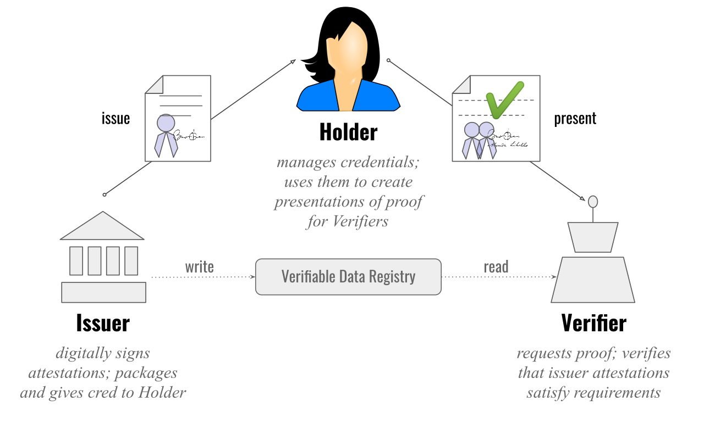

# DID, DID documents and Verifiable credentials

## Table of Contents

- [Identity with centralized provider](#centralized)
- [User/Organization as IdP](#user-idp)
- [Verifiable credential](#verifiable-credential)
- [DID *D*ecentralized *ID*entifier](#did)
	- [DID method](#did-method)
	- [DID Specific String](#did-specific-string)
	- [Path](#did-path)
	- [Query](#did-query)
	- [Fragment](#did-fragment)
- [DID documents](#did-documents)
- [DID methods](#did-methods)


## Identity with centralized provider<a name="centralized"></a>

IdentityProvider issues identity when required (Google, Facebook,...)
Various apps can associate (federate) different accounts to the IdP's; app1 uses Facebook to sign in, app2 uses Google to sign in and so on. In this case, IdP is the owner of the account and when requested from it (Sign with Google/Facebook) they will rent the account to the app/site. We, who are represented by this account are not in control/ownership of the data (we can allow or decline borrowing the account when requested). Trust here is that IdP will not do anything else that presented that we agree to borrow account and only specific data of it.

Problems:

- IdP is the owner (what happens if you break rule in IdP and your account gets deleted)
- What happens if we lose this identity (forgot username/password to log in into IdP)
- Identity is not portable/transferable to other IdP
- What happens in case of data breach?
- Privacy - IdP can track where our identity is used
- Data sharing - IdP shares more than allowed?

## User/Organization as IdP <a name="user-idp"></a>

User/organization can issue some claims about self, and send those self attestations to the relying party (R) for verification. Problem here is that RP cannot be sure that those attestations are correct. There should be some issuer that both parties trust, that will issue some credentials (id card, driving license...)

Issuer can create claims, give them to the user/organization/holder, and when needed user will send those claims (in control which claims are presented, all claims or just few) to the verifier (to whom are those claims presented). Verifier should somehow verify those claims **BY** contacting issuer directly.

## [Verifiable credential](https://www.w3.org/TR/vc-overview/) <a name="verifiable-credential"></a>

Verifiable credentials (VCs) are digital credentials which follow the relevant World Wide Web Consortium open standards. They can represent information found in physical credentials, such as a passport or license, as well as new things that have no physical equivalent, such as ownership of a bank account. 

Verifiable credentials can be issued by anyone, about anything, and can be presented to and verified by everyone. The entity that generates the credential is called the Issuer. The credential is then given to the Holder who stores it for later use. The Holder can then prove something about themselves by presenting their credentials to a Verifier.

Additional information with examples can be found [here](https://www.w3.org/TR/vc-data-model/)

Triangle of trust:



We need to solve problem of proof - how do we trust someone that they are who they say they are?

We can use *Cryptography* to solve this problem: private key to sign document (hash of the document) and public key to verify signature.

One of the problems is how verifier can know which public key from issuer to use? In theory, issuer can have multiple public keys, they can also be rotated. To do this, we need to bind issuer with it's public key, need to have some identifier to solve this.

## [DID *D*ecentralized *ID*entifier](https://www.w3.org/TR/did-1.0/) <a name="did"></a>

A decentralized identifier (DID) is a type of globally unique identifier that enables an entity to be identified in a manner that is verifiable, persistent (as long as the DID controller desires), and does not require the use of a centralized registry

Requirements for DID:

 - Permanent - should not change in future
 - Resolvable -> to some metadata (public key and other data)
 - Cryptographically verifiable - proof that we are the owner of the document
 - Decentralized
 
DID consists of following parts:

did:{did-method}:{did-specific-string}[ "?" query ] [ "#" fragment ]

### DID method <a name="did-method"></a>

A DID method is defined by a DID method specification, which specifies the precise operations by which DIDs and DID documents are created, resolved, updated, and deactivated.

For simplicity we are assuming that did method is web.

### DID Specific String <a name="did-specific-string"></a>

Part of DID that comes after method's colon (:), in our case it will be host name, where did document can be resolved (dataspace-issuer, connector-a, connector-b and so on).

#### Path <a name="did-path"></a>

did:web:host_name/path

#### Query <a name="did-query"></a>

did:web:host_name?versionId=1

#### Fragment <a name="did-fragment"></a>

did:web:host_name#key-1

Fragment use case will be most likely used in DSP usecases, referring to public keys from did document which needs to be used in verification method, in this case key with id: key-1
 
## [DID documents] <a name="did-documents"></a>

A decentralized identifier resolves (points) to a DID document, a set of data describing the DID subject, including mechanisms, such as cryptographic public keys, that the DID subject or a DID delegate can use to authenticate itself and prove its association with the DID. 

## DID methods <a name="did-methods"></a>

Just as there are many different types of URIs, all of which conform to the URI standard, there are many different types of DID methods, all of which must conform to the DID standard. Each DID method specification must define:

The name of the DID method (which must appear between the first and second colon, e.g., did:example:).
The structure of the unique identifier that must follow the second colon.

Example:

did:web:dataspace-issuer

Meaning that this did (id - dataspace-issuer) should be resolved using web and that did document should be located in http(s)://dataspace-issuer/.well-known/did.json

like following:

```
{
	"service": [],
	"verificationMethod": [
		{
			"id": "did:web:dataspace-issuer#key-1",
			"type": "JsonWebKey2020",
			"controller": "did:web:dataspace-issuer",
			"publicKeyMultibase": null,
			"publicKeyJwk": {
				"kty": "OKP",
				"crv": "Ed25519",
				"x": "Hsq2QXPbbsU7j6JwXstbpxGSgliI04g_fU3z2nwkuVc"
			}
		}
	],
	"authentication": [
		"key-1"
	],
	"id": "did:web:dataspace-issuer",
	"@context": [
		"https://www.w3.org/ns/did/v1",
		{
			"@base": "did:web:dataspace-issuer"
		}
	]
}
```

## Possible usecase <a name="usecase"></a>

 - Issuer creates did and publish did document (issuer public key) to data registry
 
---

 - Holder generates key pair
 - Holder generated did and using keys, generates and publish did document (providing proof that for that did he is the controller/owner)
 
--- 

 - Holder requests some credentials from issuer
 - Issuer creates credentials with following:

 ```
 issuer: issuer-did
 subject: holder-did
 claim1
 claim2
 ...
 sign with issuer private key
```

 - Holder receives VC and store it in it's wallet
 
 - Holder creates verifiable presentation (easiest use case that it takes VC received from Issuer, and sign it with its private key)
 
 ```
 issuer: holder-did
 subject: verifier
 claim: VC from issuer
 sign: holder private key
 ```
 
 - Verifier receives request
 - Verifier resolves "outer" did, issuer -> holder-did and verify holder signature
 - Verifier checks "internal" VC and resolves issuer as issuer-did 
 
In case of resolving did, simple use case is that each time it will be web resolver. In that case did.json document must be available on service/.well-known/did.json.
Verifier is not required to contact issuer or holder to verify claims, it just needs to resolve did and get public key(s).
